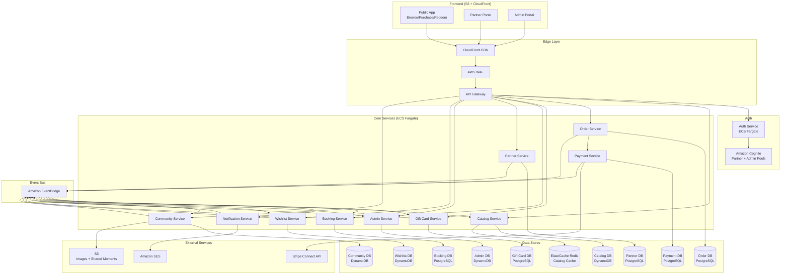
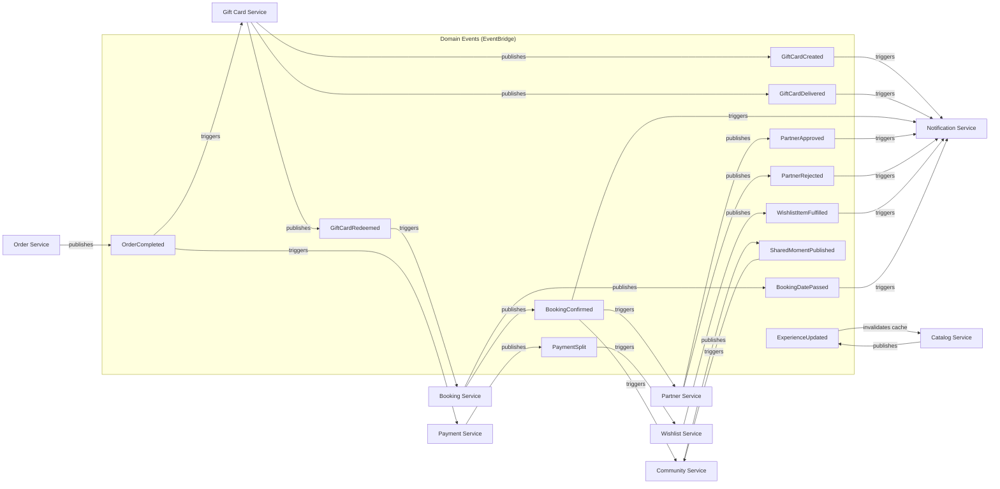
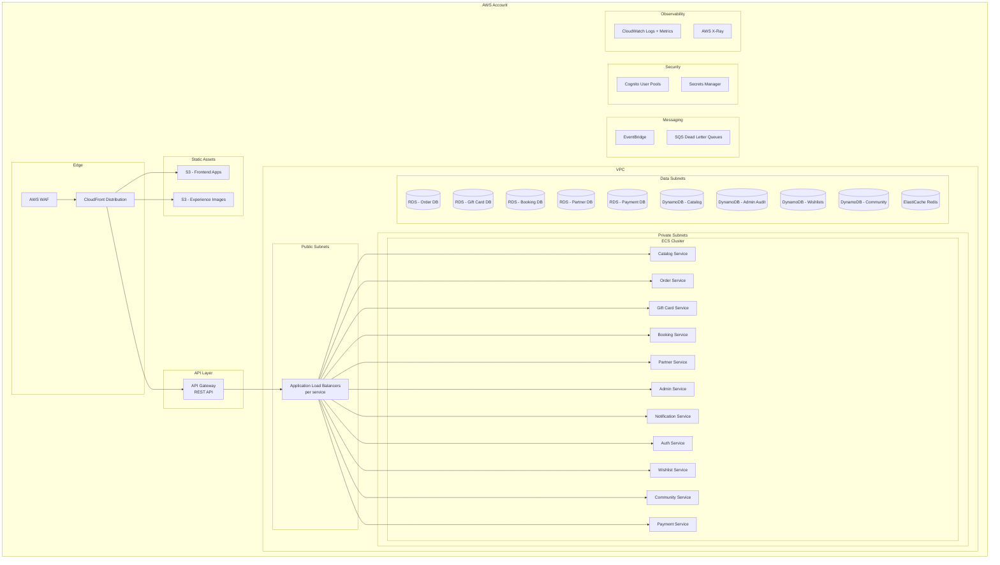
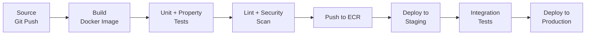
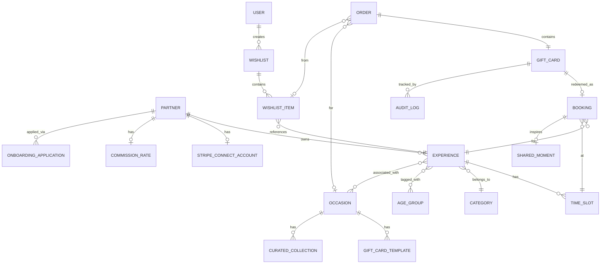
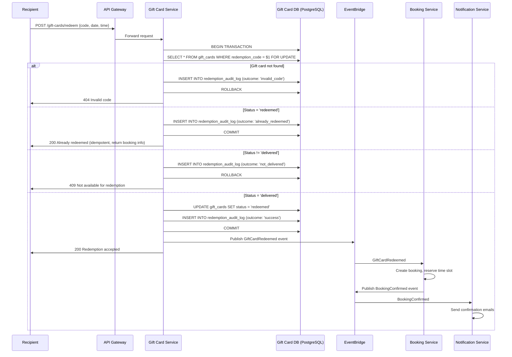

# Design Document: Experience Gift Platform

## Overview

The Experience Gift Platform is a family-first movement disguised as a web application. It exists to reduce useless, forgettable gifting for younger generations and replace it with real, shared experiences that bring families closer together. The platform empowers purchasers — parents, grandparents, aunts, uncles, and friends — to give experiences like aquarium visits, botanical garden tours, cooking classes, and outdoor adventures instead of material gifts.

The core journey is: **Browse (by age group, occasion, category) → Purchase (personal gift-card-writing experience) → Deliver → Redeem → Book → Share**.

Beyond the core gifting flow, the platform supports family wishlists (so loved ones can gift from a curated list), a community impact dashboard (showing the collective shift from material to experiential gifting), post-experience social sharing ("Look what we did!" moments), and a sustainable business model via Stripe Connect split payments with configurable partner commissions.

The system is built on AWS using a microservices architecture with event-driven inter-service communication. Each service is independently deployable, owns its own data store, and communicates asynchronously via Amazon EventBridge. The architecture prioritizes correctness of the gift card lifecycle (purchased → delivered → redeemed) with pessimistic locking for concurrent redemption safety, horizontal scalability, and zero-rearchitecture handoff readiness.

### Key Design Decisions

1. **Microservices architecture** — Eleven independently deployable services (Catalog, Order, Gift Card, Booking, Partner, Admin, Notification, Auth, Wishlist, Community, Payment), each with its own data store, API surface, and deployment pipeline. This eliminates future rearchitecture needs and allows teams to own and scale services independently.
2. **Event-driven communication via Amazon EventBridge** — Services communicate asynchronously through domain events (e.g., `OrderCompleted`, `GiftCardDelivered`, `GiftCardRedeemed`, `WishlistItemFulfilled`, `SharedMomentPublished`). This decouples services, enables eventual consistency where appropriate, and provides a natural audit trail.
3. **Database-per-service** — Each microservice owns its data store. PostgreSQL (RDS) for transactional services (Order, Gift Card, Booking, Partner, Payment), DynamoDB for high-throughput read services (Catalog, Notification logs, Admin audit logs, Wishlist, Community). This enforces bounded contexts and prevents cross-service data coupling.
4. **ECS Fargate for compute** — Container-based deployment eliminates cold starts, provides predictable performance, and supports long-running operations. Each service runs as an independent ECS service with auto-scaling.
5. **API Gateway with per-service routing** — A single API Gateway with resource-based routing to each service's ALB/target group. Provides centralized rate limiting, request validation, WAF integration, and API key management.
6. **Infrastructure as Code (AWS CDK)** — All infrastructure defined in TypeScript CDK stacks, one per service plus shared infrastructure. Enables reproducible deployments and environment parity.
7. **Stripe Connect for split payments** — Delegates PCI compliance to Stripe. Enables direct partner payouts with configurable platform commission. The platform never handles raw card data.
8. **ElastiCache Redis for catalog caching** — Reduces database load for the high-read catalog service with TTL-based invalidation on experience updates.
9. **Amazon Cognito** — Separate user pools for Purchasers/Recipients, Partners, and Admins with MFA enforcement for admin access.
10. **CloudFront + S3** — Static frontend assets, experience images, and shared moment photos served via CloudFront CDN. S3 for image/asset storage.
11. **AWS Secrets Manager** — Stripe API keys, database credentials, and other secrets managed centrally with automatic rotation.
12. **Observability stack** — CloudWatch for metrics/logs, X-Ray for distributed tracing across services, structured JSON logging for all services.
13. **DynamoDB for Wishlist and Community services** — High-read, low-write workloads with flexible schema. Wishlists are read-heavy (shared links viewed by many), community feed is append-heavy with simple query patterns.

## Architecture

### High-Level Microservices Architecture



### Event-Driven Communication



#### Event Catalog

| Event | Source | Consumers | Payload |
|-------|--------|-----------|---------|
| `OrderCompleted` | Order Service | Gift Card Service, Payment Service | `{ orderId, experienceId, partnerId, purchaserEmail, recipientName, recipientEmail, personalizedMessage, occasion, ageGroup, amountCents, wishlistItemId? }` |
| `GiftCardCreated` | Gift Card Service | Notification Service | `{ giftCardId, orderId, redemptionCode, recipientEmail, recipientName, experienceName, occasion, occasionTemplateId? }` |
| `GiftCardDelivered` | Gift Card Service | Notification Service, Admin Service | `{ giftCardId, redemptionCode, deliveredAt }` |
| `GiftCardRedeemed` | Gift Card Service | Booking Service, Notification Service | `{ giftCardId, redemptionCode, experienceId, bookingDate, bookingTime, recipientEmail }` |
| `BookingConfirmed` | Booking Service | Notification Service, Partner Service, Community Service | `{ bookingId, giftCardId, experienceId, partnerId, date, time, recipientEmail }` |
| `BookingDatePassed` | Booking Service (scheduled) | Notification Service | `{ bookingId, experienceId, recipientEmail, bookingDate }` |
| `PartnerApproved` | Partner Service | Notification Service, Auth Service, Payment Service | `{ partnerId, businessName, contactEmail }` |
| `PartnerRejected` | Partner Service | Notification Service | `{ applicationId, contactEmail, rejectionReason }` |
| `ExperienceUpdated` | Catalog Service | Catalog Service (cache invalidation) | `{ experienceId, partnerId, action: 'created' \| 'updated' \| 'deactivated', ageGroups?, occasions? }` |
| `WishlistItemFulfilled` | Wishlist Service | Notification Service | `{ wishlistId, wishlistItemId, wishlistOwnerId, wishlistOwnerEmail }` |
| `SharedMomentPublished` | Community Service | Community Service (feed update) | `{ momentId, experienceId, experienceName, publishedAt }` |
| `PaymentSplit` | Payment Service | Wishlist Service (for fulfillment tracking) | `{ orderId, partnerId, partnerAmountCents, platformAmountCents, commissionRate }` |

### Deployment Architecture



### Infrastructure Details

- **CloudFront** — CDN for static frontend assets, experience images, and API routing. Custom domain with ACM certificate.
- **AWS WAF** — Rate limiting, SQL injection protection, geo-blocking rules on CloudFront distribution.
- **API Gateway** — REST API with resource-based routing (`/catalog/*`, `/orders/*`, `/gift-cards/*`, `/bookings/*`, `/partners/*`, `/admin/*`, `/auth/*`, `/notifications/*`, `/wishlists/*`, `/community/*`). Request validation, usage plans, and API keys for partner API access.
- **ECS Fargate** — Each service runs as an independent ECS service in private subnets. Auto-scaling based on CPU/memory utilization (target 70%). Minimum 2 tasks per service for availability.
- **Application Load Balancers** — One ALB per service (or shared ALB with path-based routing) for health checks and traffic distribution.
- **RDS PostgreSQL** — Multi-AZ deployments for Order, Gift Card, Booking, Partner, and Payment databases. Automated backups with 7+ day retention. Encryption at rest with KMS.
- **DynamoDB** — On-demand capacity for Catalog (with DAX or ElastiCache for caching), Admin audit logs, Wishlists, and Community data. Global secondary indexes for query patterns.
- **ElastiCache Redis** — Cluster mode for catalog caching. TTL-based invalidation triggered by `ExperienceUpdated` events.
- **Amazon Cognito** — Three user pools: Purchaser/Recipient Pool (email/password), Partner Pool (email/password + optional MFA), and Admin Pool (email/password + required MFA).
- **Amazon EventBridge** — Custom event bus for domain events. Event rules route events to target SQS queues consumed by services. Dead letter queues for failed deliveries. New events include `WishlistItemFulfilled`, `SharedMomentPublished`, `BookingDatePassed`, and `PaymentSplit`.
- **Amazon SES** — Transactional email delivery with dedicated sending domain, DKIM/SPF configured.
- **S3** — Three buckets: frontend static assets (public read via CloudFront), experience images (public read via CloudFront with upload via presigned URLs), and shared moment photos (public read via CloudFront with upload via presigned URLs, no EXIF/location data stored).
- **AWS Secrets Manager** — Stripe API keys, database credentials, Cognito client secrets. Automatic rotation for database credentials.
- **CloudWatch** — Structured JSON logs from all services, custom metrics (order count, redemption latency, email delivery rate), alarms for error rates and latency.
- **AWS X-Ray** — Distributed tracing across all services and EventBridge. Trace IDs propagated through event payloads for end-to-end visibility.

### CI/CD Pipeline (per service)



Each service has an independent pipeline. Shared infrastructure (VPC, EventBridge, Cognito) has its own CDK pipeline deployed first.

## Components and Interfaces

### Service Boundaries and API Endpoints

#### Catalog Service
Owns experience browsing, search, filtering by category/age group/occasion, and category management. Reads from DynamoDB with Redis caching.

| Method | Path | Description |
|--------|------|-------------|
| GET | `/catalog/experiences` | List experiences with optional `category`, `ageGroup`, `occasion`, `search`, `page`, `limit` query params |
| GET | `/catalog/experiences/:id` | Get experience detail including available dates, age groups, and occasions |
| GET | `/catalog/categories` | List available experience categories |
| GET | `/catalog/occasions` | List available occasions |
| GET | `/catalog/occasions/:id/collection` | Get curated collection for an occasion (date-range aware) |
| GET | `/catalog/occasions/:id/templates` | Get occasion-specific gift card templates |

```typescript
interface CatalogService {
  listExperiences(filters: { category?: string; ageGroup?: string; occasion?: string; search?: string; page: number; limit: number }): Promise<PaginatedResult<ExperienceSummary>>;
  getExperience(id: string): Promise<ExperienceDetail | null>;
  getCategories(): Promise<Category[]>;
  getOccasions(): Promise<Occasion[]>;
  getOccasionCollection(occasionId: string, currentDate: string): Promise<CuratedCollection | null>;
  getOccasionTemplates(occasionId: string): Promise<GiftCardTemplate[]>;
}
```

#### Order Service
Owns purchase flow and payment orchestration. The purchase flow is presented as a personal gift-card-writing experience with occasion selection and age-group context. Publishes `OrderCompleted` events. Delegates payment processing to the Payment Service.

| Method | Path | Description |
|--------|------|-------------|
| POST | `/orders` | Create order: initiate gift-card-writing purchase flow with occasion, age group context |
| POST | `/orders/:id/pay` | Submit payment (routed to Payment Service for Stripe Connect split) |
| GET | `/orders/status` | Look up order by reference number + purchaser email |
| POST | `/orders/:id/resend` | Request resend of gift card delivery email (publishes event) |

```typescript
interface OrderService {
  createOrder(input: CreateOrderInput): Promise<Order>;
  processPayment(orderId: string, paymentIntentId: string): Promise<PaymentResult>;
  getOrderStatus(referenceNumber: string, purchaserEmail: string): Promise<OrderStatus | null>;
  requestResendDeliveryEmail(orderId: string): Promise<void>;
}

interface CreateOrderInput {
  purchaserEmail: string;
  recipientName: string;
  recipientEmail: string;
  experienceId: string;
  occasion: string;
  occasionTemplateId?: string;
  personalizedMessage?: string;
  wishlistItemId?: string; // if purchasing from a wishlist
}
```

#### Gift Card Service
Owns gift card lifecycle management, redemption code generation, status transitions, and audit logging. Core transactional service with pessimistic locking.

| Method | Path | Description |
|--------|------|-------------|
| POST | `/gift-cards/validate` | Validate redemption code, return experience details |
| POST | `/gift-cards/redeem` | Redeem gift card (triggers booking via event) |
| GET | `/gift-cards/:id` | Get gift card detail (admin use) |
| GET | `/gift-cards/:id/audit-log` | Get redemption audit log for a gift card |

```typescript
interface GiftCardService {
  createGiftCard(orderId: string, experienceId: string, recipientEmail: string): Promise<GiftCard>;
  validateCode(code: string): Promise<RedemptionValidation>;
  redeemGiftCard(code: string, bookingDate: string, bookingTime: string, requestingIp: string): Promise<RedemptionResult>;
  getGiftCard(id: string): Promise<GiftCardDetail | null>;
  getAuditLog(giftCardId: string): Promise<AuditLogEntry[]>;
  markAsDelivered(giftCardId: string): Promise<void>;
}
```

#### Booking Service
Owns reservation management and time slot capacity tracking. Consumes `GiftCardRedeemed` events to create bookings.

| Method | Path | Description |
|--------|------|-------------|
| GET | `/bookings/partner/:partnerId` | List bookings for a partner |
| GET | `/bookings/:id` | Get booking detail |
| GET | `/bookings/gift-card/:giftCardId` | Get booking by gift card ID |

```typescript
interface BookingService {
  createBooking(giftCardId: string, experienceId: string, timeSlotId: string, recipientEmail: string): Promise<Booking>;
  getPartnerBookings(partnerId: string, filters: BookingFilters): Promise<PaginatedResult<Booking>>;
  getBooking(id: string): Promise<BookingDetail | null>;
  getBookingByGiftCard(giftCardId: string): Promise<BookingDetail | null>;
}
```

#### Partner Service
Owns partner management, onboarding (including Stripe Connect account setup), and the partner portal API. Manages experience CRUD with required age group tagging and optional occasion associations.

| Method | Path | Description |
|--------|------|-------------|
| GET | `/partners/dashboard` | Partner dashboard data |
| POST | `/partners/experiences` | Create new experience (requires age groups) |
| PUT | `/partners/experiences/:id` | Update experience (requires age groups) |
| PATCH | `/partners/experiences/:id/status` | Activate/deactivate experience |
| GET | `/partners/bookings` | List partner bookings |
| POST | `/partners/onboarding/apply` | Submit partner onboarding application |
| GET | `/partners/onboarding` | List pending applications (admin) |
| POST | `/partners/onboarding/:id/approve` | Approve application (admin) — triggers Stripe Connect setup |
| POST | `/partners/onboarding/:id/reject` | Reject application (admin) |
| GET | `/partners/:id/stripe-connect/onboarding-link` | Get Stripe Connect onboarding link for partner |

```typescript
interface PartnerService {
  getDashboard(partnerId: string): Promise<PartnerDashboard>;
  createExperience(partnerId: string, input: CreateExperienceInput): Promise<Experience>;
  updateExperience(partnerId: string, experienceId: string, input: UpdateExperienceInput): Promise<Experience>;
  setExperienceStatus(partnerId: string, experienceId: string, status: 'active' | 'inactive'): Promise<void>;
  listBookings(partnerId: string, filters: BookingFilters): Promise<PaginatedResult<Booking>>;
  submitApplication(input: OnboardingApplicationInput): Promise<OnboardingApplication>;
  approveApplication(applicationId: string, adminId: string): Promise<Partner>;
  rejectApplication(applicationId: string, adminId: string, reason: string): Promise<void>;
  listPendingApplications(): Promise<OnboardingApplication[]>;
  getStripeConnectOnboardingLink(partnerId: string): Promise<{ url: string }>;
}

interface CreateExperienceInput {
  name: string;
  description: string;
  categoryId: string;
  priceCents: number;
  ageGroups: string[]; // required, at least one
  occasions?: string[]; // optional occasion associations
  location: string;
  imageUrls: string[];
  timeSlots: TimeSlotInput[];
  capacity: number;
}
```

#### Admin Service
Owns admin portal API, platform metrics aggregation, commission rate management, and admin action audit logging. Reads from other services via synchronous API calls or materialized views.

| Method | Path | Description |
|--------|------|-------------|
| GET | `/admin/dashboard` | Platform metrics |
| GET | `/admin/orders` | Search orders |
| GET | `/admin/gift-cards/:id` | Gift card detail with audit log |
| POST | `/admin/gift-cards/:id/resend` | Resend delivery email |
| GET | `/admin/partners` | List all partners |
| GET | `/admin/partners/commissions` | List all partners with commission rates |
| PUT | `/admin/partners/:id/commission` | Update partner commission rate |
| GET | `/admin/settings` | Get platform settings |
| PUT | `/admin/settings` | Update platform settings |
| POST | `/admin/occasions/:id/collection` | Configure curated occasion collection with date range |

```typescript
interface AdminService {
  getDashboardMetrics(timePeriod: TimePeriod): Promise<AdminMetrics>;
  searchOrders(query: OrderSearchQuery): Promise<PaginatedResult<OrderDetail>>;
  getGiftCardDetail(giftCardId: string): Promise<GiftCardDetail>;
  resendDeliveryEmail(giftCardId: string, adminId: string): Promise<void>;
  listPartners(): Promise<PartnerSummary[]>;
  getPartnerCommissions(): Promise<PartnerCommissionSummary[]>;
  updatePartnerCommission(partnerId: string, commissionRate: number, adminId: string): Promise<void>;
  getSettings(): Promise<PlatformSettings>;
  updateSettings(settings: Partial<PlatformSettings>, adminId: string): Promise<PlatformSettings>;
  configureOccasionCollection(occasionId: string, config: CuratedCollectionConfig, adminId: string): Promise<CuratedCollection>;
}
```

#### Notification Service
Owns all email delivery, template management, and retry logic. Consumes domain events and sends emails via Amazon SES.

| Method | Path | Description |
|--------|------|-------------|
| POST | `/notifications/resend/:giftCardId` | Manually trigger email resend |
| GET | `/notifications/status/:giftCardId` | Get delivery status for a gift card |

```typescript
interface NotificationService {
  sendGiftCardDelivery(giftCard: GiftCardInfo, order: OrderInfo): Promise<void>;
  sendBookingConfirmation(booking: BookingInfo, recipient: RecipientInfo): Promise<void>;
  sendPartnerBookingNotification(booking: BookingInfo, partner: PartnerInfo): Promise<void>;
  sendOnboardingConfirmation(application: ApplicationInfo): Promise<void>;
  sendPartnerWelcome(partner: PartnerInfo, tempCredentials: TempCredentials): Promise<void>;
  sendOnboardingRejection(application: ApplicationInfo, reason: string): Promise<void>;
  resendDeliveryEmail(giftCardId: string): Promise<void>;
}
```

#### Auth Service
Owns authentication and authorization. Wraps Amazon Cognito for purchaser/recipient, partner, and admin authentication, token validation, and MFA enforcement.

| Method | Path | Description |
|--------|------|-------------|
| POST | `/auth/partner/login` | Partner login |
| POST | `/auth/admin/login` | Admin login (MFA required) |
| POST | `/auth/token/refresh` | Refresh access token |
| POST | `/auth/partner/create` | Create partner credentials (internal, triggered by PartnerApproved) |
| POST | `/auth/register` | Register purchaser/recipient account |
| POST | `/auth/login` | Purchaser/recipient login |

```typescript
interface AuthService {
  authenticatePartner(email: string, password: string): Promise<AuthTokens>;
  authenticateAdmin(email: string, password: string, mfaCode: string): Promise<AuthTokens>;
  authenticateUser(email: string, password: string): Promise<AuthTokens>;
  registerUser(email: string, password: string, name: string): Promise<AuthTokens>;
  refreshToken(refreshToken: string): Promise<AuthTokens>;
  createPartnerCredentials(partnerId: string, email: string): Promise<TempCredentials>;
  validateToken(token: string): Promise<TokenClaims>;
}
```

#### Wishlist Service
Owns family wishlist management, shareable links, and fulfillment tracking. Uses DynamoDB for high-read, low-write wishlist data.

| Method | Path | Description |
|--------|------|-------------|
| POST | `/wishlists` | Create a new wishlist |
| GET | `/wishlists/:id` | Get wishlist (owner view with fulfillment status) |
| GET | `/wishlists/share/:shareToken` | Get wishlist via shareable link (purchaser view, no fulfillment details) |
| POST | `/wishlists/:id/items` | Add experience to wishlist |
| DELETE | `/wishlists/:id/items/:itemId` | Remove experience from wishlist |
| POST | `/wishlists/:id/items/:itemId/fulfill` | Mark wishlist item as fulfilled (triggered by order completion) |
| GET | `/wishlists/user/:userId` | List wishlists for a user |

```typescript
interface WishlistService {
  createWishlist(userId: string, input: CreateWishlistInput): Promise<Wishlist>;
  getWishlist(wishlistId: string, requesterId: string): Promise<WishlistDetail>;
  getWishlistByShareToken(shareToken: string): Promise<WishlistPublicView>;
  addItem(wishlistId: string, experienceId: string, note?: string): Promise<WishlistItem>;
  removeItem(wishlistId: string, itemId: string): Promise<void>;
  fulfillItem(wishlistId: string, itemId: string, orderId: string): Promise<void>;
  listUserWishlists(userId: string): Promise<WishlistSummary[]>;
}

interface CreateWishlistInput {
  name: string;
  description?: string;
}
```

#### Community Service
Owns community impact metrics aggregation, shared moments/community feed, and impact badges. Uses DynamoDB for shared moments and aggregated metrics. S3 for shared moment photos.

| Method | Path | Description |
|--------|------|-------------|
| GET | `/community/impact` | Get public community impact metrics |
| GET | `/community/impact/user/:userId` | Get individual user impact metrics |
| GET | `/community/impact/user/:userId/badge` | Generate shareable impact badge |
| GET | `/community/feed` | Get community feed of shared moments |
| POST | `/community/moments` | Submit a shared moment (requires consent) |
| POST | `/community/moments/:id/approve` | Parent/guardian approval for minor's shared moment |
| GET | `/community/moments/prompt/:bookingId` | Get sharing prompt for a past booking |

```typescript
interface CommunityService {
  getCommunityImpact(): Promise<CommunityImpactMetrics>;
  getUserImpact(userId: string): Promise<UserImpactMetrics>;
  generateImpactBadge(userId: string): Promise<ImpactBadge>;
  getCommunityFeed(page: number, limit: number): Promise<PaginatedResult<SharedMoment>>;
  submitSharedMoment(input: SubmitMomentInput): Promise<SharedMoment>;
  approveMinorMoment(momentId: string, guardianId: string): Promise<void>;
  getSharingPrompt(bookingId: string): Promise<SharingPrompt | null>;
}

interface SubmitMomentInput {
  bookingId: string;
  userId: string;
  photoUrl: string; // presigned S3 URL, EXIF stripped
  caption: string; // max 280 characters
  consentGiven: boolean; // must be true
  isMinor: boolean;
  guardianId?: string; // required if isMinor
}
```

#### Payment Service
Owns Stripe Connect integration, split payment processing, commission rate management, and partner payout tracking. Uses PostgreSQL for transactional payment records.

| Method | Path | Description |
|--------|------|-------------|
| POST | `/payments/intent` | Create Stripe Connect payment intent with split |
| POST | `/payments/webhook` | Handle Stripe webhooks |
| GET | `/payments/partner/:partnerId/payouts` | List partner payouts |
| GET | `/payments/commissions` | List all commission rates |
| PUT | `/payments/commissions/:partnerId` | Update partner commission rate |
| POST | `/payments/partner/:partnerId/stripe-connect` | Create Stripe Connect account for partner |

```typescript
interface PaymentService {
  createPaymentIntent(input: CreatePaymentIntentInput): Promise<PaymentIntent>;
  handleWebhook(event: StripeWebhookEvent): Promise<void>;
  getPartnerPayouts(partnerId: string, filters: PayoutFilters): Promise<PaginatedResult<Payout>>;
  getCommissionRates(): Promise<CommissionRate[]>;
  updateCommissionRate(partnerId: string, rate: number): Promise<CommissionRate>;
  createStripeConnectAccount(partnerId: string, email: string): Promise<StripeConnectAccount>;
}

interface CreatePaymentIntentInput {
  orderId: string;
  amountCents: number;
  currency: string;
  partnerId: string;
  partnerStripeAccountId: string;
  commissionRate: number; // platform commission percentage
}
```

### Inter-Service Communication Patterns

| Pattern | When Used | Example |
|---------|-----------|---------|
| **Synchronous (REST)** | User-facing requests requiring immediate response | Catalog browsing, order creation, redemption validation, wishlist viewing, community feed |
| **Asynchronous (EventBridge)** | Cross-service side effects, eventual consistency acceptable | Email delivery after purchase, booking creation after redemption, wishlist fulfillment, community metrics update |
| **API-to-API (internal)** | Admin service aggregating data from multiple services | Admin dashboard pulling metrics from Order, Gift Card, Booking, Payment services |

Internal service-to-service calls use private ALB endpoints within the VPC (not through API Gateway) with service discovery via AWS Cloud Map.


## Data Models

### Database-Per-Service Overview

Each microservice owns its data store. No service directly accesses another service's database.

| Service | Data Store | Rationale |
|---------|-----------|-----------|
| Catalog Service | DynamoDB + ElastiCache Redis | High-read, low-write workload. DynamoDB handles flexible schema for experiences with GSIs for age group and occasion filtering. Redis caches hot catalog data. |
| Order Service | PostgreSQL (RDS) | Transactional integrity for payment flows. ACID guarantees for order state. Stores occasion and age group context per order. |
| Gift Card Service | PostgreSQL (RDS) | Strict state machine enforcement, pessimistic locking (`SELECT ... FOR UPDATE`), atomic transactions for redemption. |
| Booking Service | PostgreSQL (RDS) | Transactional integrity for capacity management. Foreign key constraints for time slot booking. |
| Partner Service | PostgreSQL (RDS) | Relational data for partners, onboarding applications, experience ownership, and Stripe Connect account references. |
| Payment Service | PostgreSQL (RDS) | Transactional integrity for split payment records, commission rates, and payout tracking. Stripe Connect integration. |
| Admin Service | DynamoDB | High-write audit logs, flexible schema for admin action tracking. Reads from other services via API. |
| Wishlist Service | DynamoDB | High-read, low-write workload. Wishlists are read-heavy (shared links viewed by many). Flexible schema for wishlist items with fulfillment tracking. |
| Community Service | DynamoDB + S3 | Append-heavy shared moments feed with simple query patterns. S3 for photo storage. DynamoDB for metrics aggregation. |
| Notification Service | DynamoDB | Delivery status tracking, retry state. No complex queries needed. |
| Auth Service | Amazon Cognito (managed) | No custom data store — Cognito manages user pools, tokens, and MFA. |

### Entity Relationship Diagram (Cross-Service)



Note: These relationships are logical. In the microservices architecture, cross-service references use IDs (not foreign keys). Referential integrity across services is maintained via events and eventual consistency.

### Catalog Service Data (DynamoDB)

#### `experiences` table
| Attribute | Type | Key |
|-----------|------|-----|
| id | String (UUID) | Partition Key |
| partnerId | String (UUID) | GSI-1 PK |
| categoryId | String (UUID) | GSI-2 PK |
| name | String | |
| description | String | |
| priceCents | Number | |
| currency | String | |
| location | String | |
| imageUrls | List<String> | |
| ageGroups | List<String> | | 
| occasions | List<String> | |
| status | String ('active' \| 'inactive') | |
| partnerName | String | Denormalized |
| partnerInstructions | String | |
| createdAt | String (ISO 8601) | GSI-1 SK, GSI-2 SK |
| updatedAt | String (ISO 8601) | |

GSI-1: `partnerId-createdAt-index` — Query experiences by partner.
GSI-2: `categoryId-createdAt-index` — Query experiences by category.
GSI-3: `ageGroup-createdAt-index` — Query experiences by age group. Uses a flattened `primaryAgeGroup` attribute (first element of ageGroups) as PK with `createdAt` as SK. For multi-age-group queries, a scan with filter or an inverted index (`age_group_experience_mappings` table) is used.
GSI-4: `occasion-createdAt-index` — Query experiences by occasion via `occasion_experience_mappings` table.

#### `occasions` table
| Attribute | Type | Key |
|-----------|------|-----|
| id | String (UUID) | Partition Key |
| name | String | |
| displayOrder | Number | |
| isActive | Boolean | |

#### `occasion_experience_mappings` table
| Attribute | Type | Key |
|-----------|------|-----|
| occasionId | String (UUID) | Partition Key |
| experienceId | String (UUID) | Sort Key |
| createdAt | String (ISO 8601) | |

GSI: `experienceId-occasionId-index` — Reverse lookup: find all occasions for an experience.

#### `age_group_experience_mappings` table
| Attribute | Type | Key |
|-----------|------|-----|
| ageGroup | String | Partition Key |
| experienceId | String (UUID) | Sort Key |
| createdAt | String (ISO 8601) | |

GSI: `experienceId-ageGroup-index` — Reverse lookup: find all age groups for an experience.

#### `gift_card_templates` table
| Attribute | Type | Key |
|-----------|------|-----|
| id | String (UUID) | Partition Key |
| occasionId | String (UUID) | GSI-1 PK |
| name | String | |
| imageUrl | String | |
| suggestedMessage | String | |
| isActive | Boolean | |
| createdAt | String (ISO 8601) | GSI-1 SK |

GSI-1: `occasionId-createdAt-index` — Query templates by occasion.

#### `curated_collections` table
| Attribute | Type | Key |
|-----------|------|-----|
| id | String (UUID) | Partition Key |
| occasionId | String (UUID) | GSI-1 PK |
| name | String | |
| description | String | |
| experienceIds | List<String> | |
| startDate | String (ISO date) | |
| endDate | String (ISO date) | |
| isActive | Boolean | |
| createdAt | String (ISO 8601) | GSI-1 SK |

GSI-1: `occasionId-createdAt-index` — Query collections by occasion.

#### `categories` table
| Attribute | Type | Key |
|-----------|------|-----|
| id | String (UUID) | Partition Key |
| name | String | |
| displayOrder | Number | |

#### `time_slots` table
| Attribute | Type | Key |
|-----------|------|-----|
| experienceId | String (UUID) | Partition Key |
| slotId | String (UUID) | Sort Key |
| date | String (ISO date) | |
| startTime | String (HH:mm) | |
| endTime | String (HH:mm) | |
| capacity | Number | |
| bookedCount | Number | |

### Order Service Data (PostgreSQL)

#### `orders`
| Column | Type | Constraints |
|--------|------|-------------|
| id | UUID | PK |
| reference_number | VARCHAR(20) | NOT NULL, UNIQUE |
| purchaser_email | VARCHAR(255) | NOT NULL |
| recipient_name | VARCHAR(255) | NOT NULL |
| recipient_email | VARCHAR(255) | NOT NULL |
| personalized_message | TEXT | |
| experience_id | UUID | NOT NULL |
| occasion | VARCHAR(100) | NOT NULL |
| occasion_template_id | UUID | |
| age_group_context | VARCHAR(50) | |
| wishlist_item_id | UUID | |
| amount_cents | INTEGER | NOT NULL |
| currency | VARCHAR(3) | NOT NULL, DEFAULT 'USD' |
| stripe_payment_intent_id | VARCHAR(255) | |
| payment_status | ENUM('pending', 'authorized', 'captured', 'failed') | NOT NULL, DEFAULT 'pending' |
| created_at | TIMESTAMP | NOT NULL, DEFAULT NOW() |
| updated_at | TIMESTAMP | NOT NULL, DEFAULT NOW() |

Indexes: `idx_orders_reference` on `reference_number`, `idx_orders_purchaser_email` on `purchaser_email`, `idx_orders_recipient_email` on `recipient_email`.

### Gift Card Service Data (PostgreSQL)

#### `gift_cards`
| Column | Type | Constraints |
|--------|------|-------------|
| id | UUID | PK |
| order_id | UUID | NOT NULL, UNIQUE |
| experience_id | UUID | NOT NULL |
| recipient_email | VARCHAR(255) | NOT NULL |
| redemption_code | VARCHAR(20) | NOT NULL, UNIQUE |
| status | ENUM('purchased', 'delivered', 'redeemed') | NOT NULL, DEFAULT 'purchased' |
| delivered_at | TIMESTAMP | |
| redeemed_at | TIMESTAMP | |
| created_at | TIMESTAMP | NOT NULL, DEFAULT NOW() |
| updated_at | TIMESTAMP | NOT NULL, DEFAULT NOW() |

**State Machine Constraint (enforced at application and DB trigger level):**
```
purchased → delivered → redeemed
```
No other transitions are permitted. A PostgreSQL trigger enforces this:
```sql
CREATE OR REPLACE FUNCTION enforce_gift_card_lifecycle()
RETURNS TRIGGER AS $
BEGIN
  IF OLD.status = 'purchased' AND NEW.status != 'delivered' THEN
    RAISE EXCEPTION 'Invalid transition from purchased: only delivered is allowed';
  END IF;
  IF OLD.status = 'delivered' AND NEW.status != 'redeemed' THEN
    RAISE EXCEPTION 'Invalid transition from delivered: only redeemed is allowed';
  END IF;
  IF OLD.status = 'redeemed' THEN
    RAISE EXCEPTION 'Cannot transition from redeemed: terminal state';
  END IF;
  RETURN NEW;
END;
$ LANGUAGE plpgsql;
```

#### `redemption_audit_log`
| Column | Type | Constraints |
|--------|------|-------------|
| id | UUID | PK |
| redemption_code | VARCHAR(20) | NOT NULL |
| requesting_ip | VARCHAR(45) | NOT NULL |
| outcome | ENUM('success', 'already_redeemed', 'invalid_code', 'concurrent_conflict', 'not_delivered') | NOT NULL |
| gift_card_id | UUID | nullable for invalid codes |
| created_at | TIMESTAMP | NOT NULL, DEFAULT NOW() |

### Booking Service Data (PostgreSQL)

#### `bookings`
| Column | Type | Constraints |
|--------|------|-------------|
| id | UUID | PK |
| gift_card_id | UUID | NOT NULL, UNIQUE |
| experience_id | UUID | NOT NULL |
| time_slot_id | UUID | NOT NULL |
| partner_id | UUID | NOT NULL |
| recipient_email | VARCHAR(255) | NOT NULL |
| status | ENUM('confirmed', 'cancelled') | NOT NULL, DEFAULT 'confirmed' |
| created_at | TIMESTAMP | NOT NULL, DEFAULT NOW() |

#### `time_slot_reservations`
| Column | Type | Constraints |
|--------|------|-------------|
| id | UUID | PK |
| experience_id | UUID | NOT NULL |
| time_slot_id | UUID | NOT NULL |
| booking_id | UUID | FK → bookings.id, NOT NULL |
| created_at | TIMESTAMP | NOT NULL, DEFAULT NOW() |
| UNIQUE | | (time_slot_id, booking_id) |

### Partner Service Data (PostgreSQL)

#### `partners`
| Column | Type | Constraints |
|--------|------|-------------|
| id | UUID | PK |
| business_name | VARCHAR(255) | NOT NULL |
| contact_email | VARCHAR(255) | NOT NULL, UNIQUE |
| business_description | TEXT | |
| status | ENUM('active', 'inactive', 'suspended') | NOT NULL, DEFAULT 'active' |
| cognito_user_id | VARCHAR(255) | UNIQUE |
| stripe_connect_account_id | VARCHAR(255) | UNIQUE |
| stripe_connect_status | ENUM('pending', 'active', 'restricted') | DEFAULT 'pending' |
| created_at | TIMESTAMP | NOT NULL, DEFAULT NOW() |
| updated_at | TIMESTAMP | NOT NULL, DEFAULT NOW() |

#### `onboarding_applications`
| Column | Type | Constraints |
|--------|------|-------------|
| id | UUID | PK |
| business_name | VARCHAR(255) | NOT NULL |
| contact_email | VARCHAR(255) | NOT NULL |
| business_description | TEXT | NOT NULL |
| experience_categories | TEXT[] | NOT NULL |
| status | ENUM('pending_review', 'approved', 'rejected') | NOT NULL, DEFAULT 'pending_review' |
| rejection_reason | TEXT | |
| reviewed_by | VARCHAR(255) | |
| reviewed_at | TIMESTAMP | |
| created_at | TIMESTAMP | NOT NULL, DEFAULT NOW() |

### Admin Service Data (DynamoDB)

#### `admin_action_log` table
| Attribute | Type | Key |
|-----------|------|-----|
| id | String (UUID) | Partition Key |
| adminId | String | GSI-1 PK |
| actionType | String | |
| affectedRecordType | String | |
| affectedRecordId | String (UUID) | |
| details | Map | |
| createdAt | String (ISO 8601) | GSI-1 SK |

#### `platform_settings` table
| Attribute | Type | Key |
|-----------|------|-----|
| key | String | Partition Key |
| value | Map | |
| updatedBy | String | |
| updatedAt | String (ISO 8601) | |

### Notification Service Data (DynamoDB)

#### `notification_log` table
| Attribute | Type | Key |
|-----------|------|-----|
| id | String (UUID) | Partition Key |
| giftCardId | String (UUID) | GSI-1 PK |
| type | String ('delivery' \| 'booking_confirmation' \| 'partner_notification' \| 'welcome' \| 'rejection' \| 'wishlist_fulfilled' \| 'sharing_prompt') | |
| recipientEmail | String | |
| status | String ('sent' \| 'failed' \| 'retrying') | |
| retryCount | Number | |
| lastAttemptAt | String (ISO 8601) | GSI-1 SK |
| error | String | |
| createdAt | String (ISO 8601) | |

### Wishlist Service Data (DynamoDB)

#### `wishlists` table
| Attribute | Type | Key |
|-----------|------|-----|
| id | String (UUID) | Partition Key |
| userId | String (UUID) | GSI-1 PK |
| name | String | |
| description | String | |
| shareToken | String (UUID) | GSI-2 PK |
| itemCount | Number | |
| createdAt | String (ISO 8601) | GSI-1 SK |
| updatedAt | String (ISO 8601) | |

GSI-1: `userId-createdAt-index` — Query wishlists by user.
GSI-2: `shareToken-index` — Lookup wishlist by shareable link token.

#### `wishlist_items` table
| Attribute | Type | Key |
|-----------|------|-----|
| wishlistId | String (UUID) | Partition Key |
| itemId | String (UUID) | Sort Key |
| experienceId | String (UUID) | |
| experienceName | String | Denormalized |
| experiencePriceCents | Number | Denormalized |
| experienceImageUrl | String | Denormalized |
| note | String | Optional personal note |
| fulfillmentStatus | String ('unfulfilled' \| 'fulfilled') | |
| fulfilledByOrderId | String (UUID) | |
| fulfilledAt | String (ISO 8601) | |
| createdAt | String (ISO 8601) | |

### Community Service Data (DynamoDB)

#### `shared_moments` table
| Attribute | Type | Key |
|-----------|------|-----|
| id | String (UUID) | Partition Key |
| bookingId | String (UUID) | GSI-1 PK |
| userId | String (UUID) | GSI-2 PK |
| experienceId | String (UUID) | |
| experienceName | String | Denormalized |
| photoUrl | String | S3 URL, EXIF stripped |
| caption | String | Max 280 characters |
| consentGiven | Boolean | Must be true |
| isMinor | Boolean | |
| guardianApproved | Boolean | Required if isMinor |
| guardianId | String (UUID) | |
| status | String ('pending_approval' \| 'published' \| 'rejected') | |
| publishedAt | String (ISO 8601) | GSI-3 SK |
| createdAt | String (ISO 8601) | GSI-2 SK |

GSI-1: `bookingId-index` — Lookup moment by booking.
GSI-2: `userId-createdAt-index` — Query moments by user.
GSI-3: `status-publishedAt-index` — Query published moments for community feed (PK: status = 'published', SK: publishedAt for chronological ordering).

#### `community_impact_metrics` table
| Attribute | Type | Key |
|-----------|------|-----|
| metricKey | String | Partition Key |
| metricPeriod | String | Sort Key |
| totalFamilies | Number | |
| totalExperiencesGifted | Number | |
| estimatedFamilyHours | Number | |
| updatedAt | String (ISO 8601) | |

`metricKey` values: `"global"` for platform-wide, `"user#{userId}"` for individual metrics.
`metricPeriod` values: `"2024"` for yearly, `"2024-01"` for monthly, `"all-time"` for cumulative.

#### `impact_badges` table
| Attribute | Type | Key |
|-----------|------|-----|
| userId | String (UUID) | Partition Key |
| badgeType | String | Sort Key |
| totalExperiencesGifted | Number | |
| estimatedMaterialGiftsReplaced | Number | |
| badgeImageUrl | String | |
| generatedAt | String (ISO 8601) | |

### Payment Service Data (PostgreSQL)

#### `commission_rates`
| Column | Type | Constraints |
|--------|------|-------------|
| id | UUID | PK |
| partner_id | UUID | NOT NULL, UNIQUE |
| rate_percent | DECIMAL(5,2) | NOT NULL, CHECK (rate_percent >= 0 AND rate_percent <= 100) |
| is_default | BOOLEAN | NOT NULL, DEFAULT false |
| created_at | TIMESTAMP | NOT NULL, DEFAULT NOW() |
| updated_at | TIMESTAMP | NOT NULL, DEFAULT NOW() |

Default commission rate row: `partner_id = NULL, is_default = true, rate_percent = 17.5` (midpoint of 15-20% range).

#### `payment_splits`
| Column | Type | Constraints |
|--------|------|-------------|
| id | UUID | PK |
| order_id | UUID | NOT NULL, UNIQUE |
| partner_id | UUID | NOT NULL |
| stripe_payment_intent_id | VARCHAR(255) | NOT NULL |
| stripe_transfer_id | VARCHAR(255) | |
| total_amount_cents | INTEGER | NOT NULL |
| platform_amount_cents | INTEGER | NOT NULL |
| partner_amount_cents | INTEGER | NOT NULL |
| commission_rate_percent | DECIMAL(5,2) | NOT NULL |
| currency | VARCHAR(3) | NOT NULL, DEFAULT 'USD' |
| status | ENUM('pending', 'completed', 'failed') | NOT NULL, DEFAULT 'pending' |
| created_at | TIMESTAMP | NOT NULL, DEFAULT NOW() |
| updated_at | TIMESTAMP | NOT NULL, DEFAULT NOW() |

Indexes: `idx_payment_splits_partner` on `partner_id`, `idx_payment_splits_order` on `order_id`.

#### `partner_stripe_accounts`
| Column | Type | Constraints |
|--------|------|-------------|
| id | UUID | PK |
| partner_id | UUID | NOT NULL, UNIQUE |
| stripe_account_id | VARCHAR(255) | NOT NULL, UNIQUE |
| status | ENUM('pending', 'active', 'restricted') | NOT NULL, DEFAULT 'pending' |
| payouts_enabled | BOOLEAN | NOT NULL, DEFAULT false |
| created_at | TIMESTAMP | NOT NULL, DEFAULT NOW() |
| updated_at | TIMESTAMP | NOT NULL, DEFAULT NOW() |

### Redemption Flow (Critical Path)

The redemption flow spans the Gift Card Service and Booking Service, coordinated via events:



The `SELECT ... FOR UPDATE` acquires a row-level exclusive lock on the gift card record within the Gift Card Service's database. Any concurrent transaction attempting to lock the same row will block until the first transaction completes, ensuring only one redemption succeeds.


## Correctness Properties

*A property is a characteristic or behavior that should hold true across all valid executions of a system — essentially, a formal statement about what the system should do. Properties serve as the bridge between human-readable specifications and machine-verifiable correctness guarantees.*

### Property 1: Catalog experience data completeness

*For any* experience in the catalog listing, the response object shall contain a non-empty name, description, partner name, price greater than zero, at least one image URL, at least one age group, and the associated occasions (if any).

**Validates: Requirements 1.1, 12.1, 12.3**

### Property 2: Category filter correctness

*For any* set of experiences and any selected category, all experiences returned by the category filter shall belong to the selected category, and no experience belonging to that category (that is active) shall be omitted from the results.

**Validates: Requirements 1.2**

### Property 3: Search term filter correctness

*For any* set of experiences and any non-empty search term, all experiences returned by the search shall contain the search term (case-insensitive) in either their name or description.

**Validates: Requirements 1.6**

### Property 4: Experience detail completeness

*For any* experience, the detail endpoint shall return the description, price, recommended age groups, available dates, partner information, and a purchase action — all matching the stored experience record.

**Validates: Requirements 2.1, 2.5**

### Property 5: Order creation input validation

*For any* order creation request, the system shall reject the request if purchaser email, recipient name, recipient email, or occasion is missing or empty, and the order table shall remain unchanged.

**Validates: Requirements 2.2**

### Property 6: Delivery email content completeness

*For any* gift card and its associated order, the generated delivery email content shall contain the recipient name, purchaser email, personalized message (if provided), experience name, redemption code, and a redemption page URL.

**Validates: Requirements 3.2**

### Property 7: Delivered gift card validation returns experience details

*For any* gift card with status "delivered", validating its redemption code shall return the associated experience details, personalized message, and available booking dates and times.

**Validates: Requirements 4.1**

### Property 8: Atomic redemption creates booking and transitions status

*For any* gift card with status "delivered" and any valid available time slot, redeeming the gift card shall atomically create a booking with status "confirmed" and update the gift card status to "redeemed", such that after the operation the gift card status is "redeemed" and exactly one booking exists for that gift card.

**Validates: Requirements 4.5, 9.5**

### Property 9: Concurrent redemption safety

*For any* gift card with status "delivered", if two redemption attempts are made concurrently, exactly one shall succeed and the other shall be rejected, and exactly one booking shall exist for that gift card after both attempts complete.

**Validates: Requirements 4.6**

### Property 10: Idempotent redemption

*For any* gift card with status "redeemed" and an existing booking, a subsequent redemption request for the same redemption code shall return the existing booking details without creating a duplicate booking, and the total number of bookings for that gift card shall remain one.

**Validates: Requirements 4.7**

### Property 11: Booking confirmation email content completeness

*For any* confirmed booking, the generated recipient confirmation email shall contain the experience name, booking date, booking time, location, and partner-provided instructions.

**Validates: Requirements 4.8**

### Property 12: Partner dashboard lists all owned experiences

*For any* partner, the dashboard endpoint shall return all experiences owned by that partner (and no experiences owned by other partners), each with their current status and upcoming bookings.

**Validates: Requirements 5.1**

### Property 13: Experience creation input validation

*For any* experience creation request, the system shall reject the request if any of the following required fields are missing: name, description, category, price, at least one available date/time, location, capacity, at least one image, or at least one age group.

**Validates: Requirements 5.2, 12.4**

### Property 14: Experience update round-trip

*For any* experience and any valid update payload, after updating the experience, retrieving it from the catalog shall reflect the updated values.

**Validates: Requirements 5.3**

### Property 15: Inactive experiences excluded from catalog

*For any* experience with status "inactive", the public catalog listing and search endpoints shall not include that experience in results.

**Validates: Requirements 5.4**

### Property 16: Booked dates cannot be removed

*For any* experience with a confirmed booking on a specific date, attempting to remove that date from the experience's availability shall be rejected, and the availability shall remain unchanged.

**Validates: Requirements 5.5**

### Property 17: Onboarding application input validation

*For any* onboarding application submission, the system shall reject the request if business name, contact email, business description, or experience categories is missing or empty.

**Validates: Requirements 6.1**

### Property 18: Onboarding application stored as pending

*For any* valid onboarding application submission, the stored application shall have status "pending_review".

**Validates: Requirements 6.2**

### Property 19: Approved application creates partner account

*For any* onboarding application with status "pending_review", approving it shall create a partner account with the application's business name and contact email, and the application status shall transition to "approved".

**Validates: Requirements 6.3, 10.7**

### Property 20: Order status lookup round-trip

*For any* order in the system, looking it up by its reference number and purchaser email shall return the correct gift card status and, if redeemed, the associated booking details.

**Validates: Requirements 7.1**

### Property 21: Payment data storage restriction

*For any* completed order, the stored order record shall contain only the Stripe payment intent ID, amount, currency, and payment status — and shall not contain any raw card number, CVV, or full card details.

**Validates: Requirements 8.3**

### Property 22: Redemption code format validity

*For any* generated redemption code, the code shall be an alphanumeric string of at least 12 characters.

**Validates: Requirements 9.1**

### Property 23: Redemption code uniqueness

*For any* set of N generated gift cards, all N redemption codes shall be distinct.

**Validates: Requirements 9.2**

### Property 24: Gift card lifecycle state machine

*For any* gift card in any state, a status update shall succeed if and only if it follows a valid transition (purchased → delivered, delivered → redeemed). All other transitions (e.g., purchased → redeemed, delivered → purchased, redeemed → anything) shall be rejected.

**Validates: Requirements 9.3, 9.4**

### Property 25: Redemption audit log completeness

*For any* redemption attempt (successful or failed), the system shall record an audit log entry containing the redemption code, timestamp, requesting IP address, and outcome (success, already_redeemed, invalid_code, concurrent_conflict, or not_delivered).

**Validates: Requirements 9.6**

### Property 26: Gift card create-retrieve round-trip

*For any* valid gift card, creating the gift card and then retrieving it by redemption code shall return an equivalent gift card object with matching order ID, redemption code, and status.

**Validates: Requirements 9.7**

### Property 27: Admin dashboard metrics accuracy

*For any* set of orders, partners, gift cards, and bookings within a time period, the admin dashboard metrics shall accurately reflect the total count of orders, sum of revenue, count of active partners, count of gift cards grouped by status, and count of bookings.

**Validates: Requirements 10.2**

### Property 28: Admin order search completeness

*For any* order in the system, searching by its order reference number, purchaser email, or recipient email shall include that order in the results with full gift card and booking details.

**Validates: Requirements 10.3**

### Property 29: Admin gift card detail includes lifecycle history

*For any* gift card, the admin detail view shall include all status transitions with timestamps and the complete redemption audit log for that redemption code.

**Validates: Requirements 10.4**

### Property 30: Onboarding queue shows only pending applications sorted by date

*For any* set of onboarding applications, the admin onboarding queue shall return exactly those with status "pending_review", sorted by submission date in ascending order.

**Validates: Requirements 10.6**

### Property 31: Rejection requires reason

*For any* partner onboarding rejection request, the system shall reject the request if no rejection reason is provided.

**Validates: Requirements 10.8**

### Property 32: Partner management list accuracy

*For any* set of partners, the admin partner management endpoint shall return all partners, each with their correct status, count of active experiences, and total bookings count.

**Validates: Requirements 10.9**

### Property 33: Admin action audit logging

*For any* admin action (approve, reject, resend email, update settings, update commission rate), the system shall record an audit log entry containing the admin identity, action type, affected record type and ID, and timestamp.

**Validates: Requirements 10.11**

### Property 34: Age group filter correctness

*For any* set of experiences and any selected age group, all experiences returned by the age group filter shall be tagged with the selected age group, and no active experience tagged with that age group shall be omitted from the results.

**Validates: Requirements 1.3, 12.2**

### Property 35: Occasion filter correctness

*For any* set of experiences and any selected occasion, all experiences returned by the occasion filter shall be associated with the selected occasion, and no active experience associated with that occasion shall be omitted from the results.

**Validates: Requirements 1.4, 13.1, 13.2**

### Property 36: Compound filter correctness

*For any* set of experiences and any combination of category, age group, and occasion filters, the returned results shall be exactly the intersection of the results that each individual filter would return independently.

**Validates: Requirements 1.5**

### Property 37: Occasion-specific gift card templates

*For any* occasion, querying templates for that occasion shall return only templates associated with that occasion, each containing a non-empty name, image URL, and suggested message.

**Validates: Requirements 2.4, 13.3**

### Property 38: Curated collection date-range display

*For any* curated collection with a configured start date and end date, the collection shall appear in browse results when the current date is within the range (inclusive) and shall not appear when the current date is outside the range.

**Validates: Requirements 13.4**

### Property 39: Wishlist item addition

*For any* wishlist and any experience from the catalog, adding the experience to the wishlist shall increase the wishlist item count by one, and the wishlist shall contain the added experience with its optional note.

**Validates: Requirements 14.1**

### Property 40: Wishlist share link uniqueness

*For any* set of N created wishlists, all N share tokens shall be distinct.

**Validates: Requirements 14.2**

### Property 41: Wishlist share link displays experiences

*For any* wishlist with items, accessing the wishlist via its share token shall return all wishlist items with experience details, and shall not expose fulfillment status to the viewer.

**Validates: Requirements 14.3**

### Property 42: Wishlist fulfillment marking and notification privacy

*For any* wishlist item that is purchased, the item shall be marked as "fulfilled", and the notification sent to the wishlist owner shall not contain the specific experience name or purchaser identity.

**Validates: Requirements 14.4**

### Property 43: Wishlist item fulfillment status display

*For any* wishlist viewed by its owner, each item shall include its fulfillment status (unfulfilled or fulfilled).

**Validates: Requirements 14.5**

### Property 44: Wishlist item removal

*For any* wishlist with N items, removing an item shall result in the wishlist having N-1 items, and the removed item shall no longer appear in the wishlist.

**Validates: Requirements 14.6**

### Property 45: Community impact metrics accuracy

*For any* set of completed gift card purchases, the public community impact dashboard shall accurately reflect the total number of distinct families (unique purchaser emails), total experiences gifted, and estimated family hours (computed as a function of experience count).

**Validates: Requirements 15.1**

### Property 46: Individual impact metrics accuracy

*For any* registered user with completed orders, the individual impact metrics shall accurately reflect the total experiences gifted by that user and the estimated number of material gifts replaced (equal to experiences gifted).

**Validates: Requirements 15.2**

### Property 47: Impact badge content completeness

*For any* user with impact metrics, the generated impact badge shall contain the user's total experiences gifted and estimated material gifts replaced.

**Validates: Requirements 15.3**

### Property 48: Post-experience sharing prompt

*For any* booking whose date has passed, the system shall return a sharing prompt for that booking when queried.

**Validates: Requirements 16.1**

### Property 49: Shared moment caption length validation

*For any* shared moment submission with a caption exceeding 280 characters, the system shall reject the submission and the shared moments store shall remain unchanged.

**Validates: Requirements 16.2**

### Property 50: Shared moment consent and parental approval

*For any* shared moment submission, the moment shall only be published if `consentGiven` is true. Additionally, if the submitter is a minor (`isMinor` is true), the moment shall only be published after guardian approval is recorded.

**Validates: Requirements 16.3, 16.4**

### Property 51: Published moments appear in community feed

*For any* shared moment with status "published", the moment shall appear in the community feed results.

**Validates: Requirements 16.5**

### Property 52: Stripe Connect split payment correctness

*For any* gift card purchase, the Stripe Connect payment shall split the total amount into a platform portion and a partner portion based on the partner's commission rate, and the partner portion shall be directed to the partner's connected Stripe account.

**Validates: Requirements 17.1, 17.3**

### Property 53: Commission rate bounds and application

*For any* partner, the applied commission rate shall be between 0% and 100% (inclusive), and the default commission rate for new partners shall be between 15% and 20%. For any purchase, `platform_amount_cents + partner_amount_cents` shall equal `total_amount_cents`.

**Validates: Requirements 17.2**

### Property 54: Admin commission rate management

*For any* set of partners with commission rates, the admin commission management endpoint shall return all partners with their current commission rates, and updating a partner's rate shall be reflected in subsequent queries.

**Validates: Requirements 17.4**

### Property 55: No purchaser service fees

*For any* order, the amount charged to the purchaser shall equal the experience price with no additional service fee applied.

**Validates: Requirements 17.5**


## Error Handling

### Error Response Format

All API errors follow a consistent JSON structure across all services:

```json
{
  "error": {
    "code": "GIFT_CARD_ALREADY_REDEEMED",
    "message": "This gift card has already been redeemed.",
    "requestId": "abc-123-def",
    "traceId": "1-abc-def",
    "details": {}
  }
}
```

The `requestId` and `traceId` fields enable cross-service debugging via X-Ray.

### Error Categories

#### Payment Errors (Order Service)
| Scenario | HTTP Status | Error Code | Behavior |
|----------|-------------|------------|----------|
| Stripe declines card | 402 | `PAYMENT_DECLINED` | Return descriptive message, retain form data |
| Stripe network timeout | 502 | `PAYMENT_GATEWAY_ERROR` | Advise retry, do NOT create duplicate charge |
| Stripe webhook failure | — | — | Retry with exponential backoff (Stripe handles this) |

**Idempotency for payments:** Each order uses a Stripe idempotency key derived from the order ID. If a network error occurs mid-payment, retrying with the same key ensures no duplicate charge is created.

#### Redemption Errors (Gift Card Service)
| Scenario | HTTP Status | Error Code | Behavior |
|----------|-------------|------------|----------|
| Invalid redemption code | 404 | `INVALID_REDEMPTION_CODE` | Log audit entry with outcome `invalid_code` |
| Gift card status "purchased" | 409 | `GIFT_CARD_NOT_DELIVERED` | Log audit entry with outcome `not_delivered` |
| Gift card status "redeemed" | 200 | — | Return existing booking (idempotent), log `already_redeemed` |
| Concurrent redemption conflict | 409 | `CONCURRENT_REDEMPTION` | Log audit entry with outcome `concurrent_conflict` |
| Time slot full | 409 | `TIME_SLOT_UNAVAILABLE` | Return available alternatives |

#### Event Processing Errors (EventBridge)
| Scenario | Behavior |
|----------|----------|
| Event delivery failure | EventBridge retries with exponential backoff for up to 24 hours |
| Consumer processing failure | SQS dead letter queue captures failed events after 3 retries |
| Event schema mismatch | Log error, send to DLQ, alert via CloudWatch alarm |
| Duplicate event delivery | All consumers implement idempotent handlers (using event ID deduplication) |

#### Email Delivery Errors (Notification Service)
| Scenario | Behavior |
|----------|----------|
| SES send failure | Retry up to 3 times with exponential backoff (1s, 2s, 4s) |
| All retries exhausted | Log failure to notification_log table, publish `NotificationFailed` event for manual review |
| Bounce/complaint | Log for admin review via SES notifications, update notification_log |

#### Input Validation Errors (All Services)
| Scenario | HTTP Status | Behavior |
|----------|-------------|----------|
| Missing required fields | 400 | Return field-level validation errors |
| Invalid email format | 400 | Return specific field error |
| Invalid state transition | 409 | Return current state and allowed transitions |
| Caption exceeds 280 characters | 400 | Return validation error for caption length |
| Missing consent for shared moment | 400 | Return error requiring explicit consent |
| Missing guardian approval for minor | 403 | Return error requiring guardian approval |
| Invalid commission rate | 400 | Return error with valid range |

#### Wishlist Errors (Wishlist Service)
| Scenario | HTTP Status | Error Code | Behavior |
|----------|-------------|------------|----------|
| Wishlist not found | 404 | `WISHLIST_NOT_FOUND` | Return error message |
| Invalid share token | 404 | `INVALID_SHARE_TOKEN` | Return error message |
| Item already in wishlist | 409 | `ITEM_ALREADY_IN_WISHLIST` | Return existing item |
| Item already fulfilled | 409 | `ITEM_ALREADY_FULFILLED` | Return fulfillment details |

#### Payment Split Errors (Payment Service)
| Scenario | HTTP Status | Error Code | Behavior |
|----------|-------------|------------|----------|
| Partner Stripe account not active | 402 | `PARTNER_PAYOUTS_DISABLED` | Return error, advise partner to complete Stripe Connect setup |
| Commission rate not configured | 500 | `COMMISSION_RATE_MISSING` | Use default rate, log warning |
| Stripe Connect transfer failure | 502 | `TRANSFER_FAILED` | Retry with backoff, log for manual review |

#### Inter-Service Communication Errors
| Scenario | Behavior |
|----------|----------|
| Downstream service unavailable | Circuit breaker opens after 5 consecutive failures, returns 503 |
| Service timeout | 10s timeout for synchronous calls, retry once, then fail with 504 |
| Database connection failure | Connection pool retry with exponential backoff, return 503 after exhaustion |

### Retry Strategy

All retryable operations use exponential backoff with jitter:
- Base delay: 100ms
- Max retries: 3 (configurable per service)
- Backoff formula: `min(base * 2^attempt + random_jitter, max_delay)`
- Max delay cap: 10 seconds

### Circuit Breaker Pattern

Inter-service synchronous calls use a circuit breaker:
- **Closed** (normal): Requests pass through. Track failure count.
- **Open** (tripped): After 5 consecutive failures, reject requests immediately for 30 seconds.
- **Half-Open** (testing): After timeout, allow one request through. If it succeeds, close the circuit. If it fails, reopen.

## Testing Strategy

### Dual Testing Approach

The platform uses both unit tests and property-based tests for comprehensive coverage:

- **Unit tests** verify specific examples, edge cases, integration points, and error conditions
- **Property-based tests** verify universal properties across randomly generated inputs
- Together they provide complementary coverage: unit tests catch concrete bugs, property tests verify general correctness

### Property-Based Testing Configuration

- **Library:** [fast-check](https://github.com/dubzzz/fast-check) for TypeScript/Node.js
- **Minimum iterations:** 100 per property test
- **Each property test references its design document property** with a tag comment:
  ```
  // Feature: experience-gift-platform, Property N: <property text>
  ```
- **Each correctness property is implemented by a single property-based test**

### Test Categories

#### Unit Tests (per service)

- **Catalog Service:** Verify specific filter/search examples, empty results message, pagination edge cases, Redis cache hit/miss behavior, age group and occasion filter examples, curated collection date boundary cases
- **Order Service:** Verify payment declined error message, order confirmation response shape, resend email event publishing, occasion and age group context stored correctly
- **Gift Card Service:** Verify invalid code error (4.2), purchased-not-delivered error (4.4), already-redeemed idempotent response (4.3), state machine trigger enforcement
- **Booking Service:** Verify time slot capacity enforcement, booking creation from event payload, duplicate booking prevention, BookingDatePassed event scheduling
- **Partner Service:** Verify experience creation with all fields including age groups, deactivation publishes event, onboarding application validation, Stripe Connect onboarding link generation
- **Admin Service:** Verify MFA requirement, settings update, email resend event publishing, audit log recording, commission rate update validation
- **Notification Service:** Verify retry behavior on failure (3 retries with backoff), email template rendering, idempotent event handling, wishlist fulfillment notification content (no spoilers), sharing prompt delivery
- **Auth Service:** Verify Cognito integration, token validation, MFA enforcement for admin pool, user registration
- **Wishlist Service:** Verify wishlist creation, share token generation, item addition/removal, fulfillment marking, duplicate item prevention, invalid share token error
- **Community Service:** Verify shared moment submission validation (caption length, consent), minor guardian approval flow, community feed pagination, impact metrics aggregation, EXIF stripping on photo upload
- **Payment Service:** Verify Stripe Connect account creation, split payment calculation, commission rate CRUD, default rate fallback, idempotent webhook handling

#### Property-Based Tests (per service)

Each property from the Correctness Properties section is implemented as a single `fast-check` property test within the owning service:

| Property | Service | Test Description | Key Generators |
|----------|---------|-----------------|----------------|
| 1 | Catalog | Catalog data completeness (incl. age groups) | Random experiences with varying fields |
| 2 | Catalog | Category filter correctness | Random experiences × random categories |
| 3 | Catalog | Search filter correctness | Random experiences × random search terms |
| 4 | Catalog | Experience detail completeness (incl. age groups) | Random experience IDs |
| 5 | Order | Order input validation (incl. occasion) | Random partial order inputs (missing fields) |
| 6 | Notification | Delivery email content | Random gift cards × random orders |
| 7 | Gift Card | Delivered gift card validation | Random delivered gift cards |
| 8 | Gift Card + Booking | Atomic redemption | Random delivered gift cards × random time slots |
| 9 | Gift Card | Concurrent redemption safety | Random delivered gift cards with parallel attempts |
| 10 | Gift Card | Idempotent redemption | Random redeemed gift cards with existing bookings |
| 11 | Notification | Booking email content | Random confirmed bookings |
| 12 | Partner | Partner dashboard completeness | Random partners with random experiences |
| 13 | Partner | Experience creation validation (incl. age groups) | Random partial experience inputs |
| 14 | Catalog + Partner | Experience update round-trip | Random experiences × random update payloads |
| 15 | Catalog | Inactive experience exclusion | Random experiences with mixed statuses |
| 16 | Partner + Booking | Booked date protection | Random experiences with bookings on random dates |
| 17 | Partner | Onboarding input validation | Random partial application inputs |
| 18 | Partner | Onboarding stored as pending | Random valid applications |
| 19 | Partner | Approval creates partner | Random pending applications |
| 20 | Order + Gift Card | Order status lookup round-trip | Random orders with varying gift card statuses |
| 21 | Order | Payment data storage restriction | Random completed orders |
| 22 | Gift Card | Redemption code format | Batch-generated redemption codes |
| 23 | Gift Card | Redemption code uniqueness | Batch-generated gift cards |
| 24 | Gift Card | Lifecycle state machine | Random gift card states × random target states |
| 25 | Gift Card | Redemption audit log completeness | Random redemption attempts (all outcome types) |
| 26 | Gift Card | Gift card create-retrieve round-trip | Random valid gift card inputs |
| 27 | Admin | Admin dashboard metrics | Random platform data sets |
| 28 | Admin | Admin order search | Random orders × search by each field |
| 29 | Admin + Gift Card | Gift card detail with history | Random gift cards with lifecycle events |
| 30 | Partner | Onboarding queue filtering/sorting | Random applications with mixed statuses |
| 31 | Partner | Rejection requires reason | Random rejection requests (with/without reason) |
| 32 | Admin | Partner management accuracy | Random partners with experiences and bookings |
| 33 | Admin | Admin action audit logging | Random admin actions (incl. commission updates) |
| 34 | Catalog | Age group filter correctness | Random experiences × random age groups |
| 35 | Catalog | Occasion filter correctness | Random experiences × random occasions |
| 36 | Catalog | Compound filter correctness | Random experiences × random filter combinations |
| 37 | Catalog | Occasion-specific templates | Random occasions × random templates |
| 38 | Catalog | Curated collection date-range display | Random collections × random current dates |
| 39 | Wishlist | Wishlist item addition | Random wishlists × random experiences |
| 40 | Wishlist | Wishlist share link uniqueness | Batch-generated wishlists |
| 41 | Wishlist | Share link displays experiences | Random wishlists with items |
| 42 | Wishlist | Fulfillment marking + notification privacy | Random wishlist purchases |
| 43 | Wishlist | Fulfillment status display | Random wishlists with mixed fulfillment states |
| 44 | Wishlist | Wishlist item removal | Random wishlists with items |
| 45 | Community | Community impact metrics accuracy | Random sets of completed orders |
| 46 | Community | Individual impact metrics accuracy | Random users with completed orders |
| 47 | Community | Impact badge content completeness | Random users with impact metrics |
| 48 | Community | Post-experience sharing prompt | Random bookings with past dates |
| 49 | Community | Caption length validation | Random captions of varying lengths |
| 50 | Community | Consent and parental approval | Random moment submissions (minor/adult, with/without consent) |
| 51 | Community | Published moments in feed | Random published moments |
| 52 | Payment | Stripe Connect split payment correctness | Random orders × random commission rates |
| 53 | Payment | Commission rate bounds | Random partners × random rates |
| 54 | Payment + Admin | Commission rate management | Random partners with commission rates |
| 55 | Payment | No purchaser service fees | Random orders × random experience prices |

#### Integration Tests (cross-service)

- **Event flow tests:** Verify EventBridge event publishing and consumption between services (e.g., OrderCompleted → GiftCardCreated → GiftCardDelivered, WishlistItemFulfilled → Notification, BookingDatePassed → sharing prompt notification)
- **Stripe Connect integration:** Verify payment intent creation with split, transfer to connected account, webhook handling, commission rate application via Payment Service
- **SES integration:** Verify email sending, bounce handling via Notification Service
- **Cognito integration:** Verify partner/admin/user authentication, MFA enforcement via Auth Service
- **Full purchase-to-redemption flow:** End-to-end test of the core journey across all services, including occasion selection and age group context
- **Wishlist purchase flow:** End-to-end test of purchasing from a wishlist, verifying fulfillment marking and privacy-preserving notification
- **Community sharing flow:** End-to-end test of booking → date passes → sharing prompt → moment submission → consent → feed display
- **Circuit breaker tests:** Verify graceful degradation when downstream services are unavailable

#### Contract Tests

- **Consumer-driven contracts** between services to ensure API compatibility during independent deployments
- **Event schema validation** to ensure EventBridge event payloads match expected schemas across producer and consumer services

### Test Environment

- **Database:** PostgreSQL test instances (or testcontainers) with migrations applied per service. DynamoDB Local for DynamoDB-backed services (Catalog, Admin, Wishlist, Community, Notification).
- **Event bus:** LocalStack EventBridge or in-memory event bus mock for unit/property tests. Real EventBridge in staging.
- **External services:** Mocked Stripe Connect and SES for unit/property tests; real services for integration tests in staging.
- **S3:** LocalStack S3 or in-memory mock for shared moment photo uploads in unit/property tests.
- **Service mocks:** For cross-service integration tests, use WireMock or similar to mock downstream service APIs.
- **Test data:** Generated via fast-check arbitraries for property tests; fixtures for unit tests. Custom arbitraries for age groups (enum of 5 values), occasions, wishlists, shared moments, and commission rates.
- **CI/CD:** Each service's test suite runs independently in its pipeline. Cross-service integration tests run in a dedicated staging environment after all service deployments.
